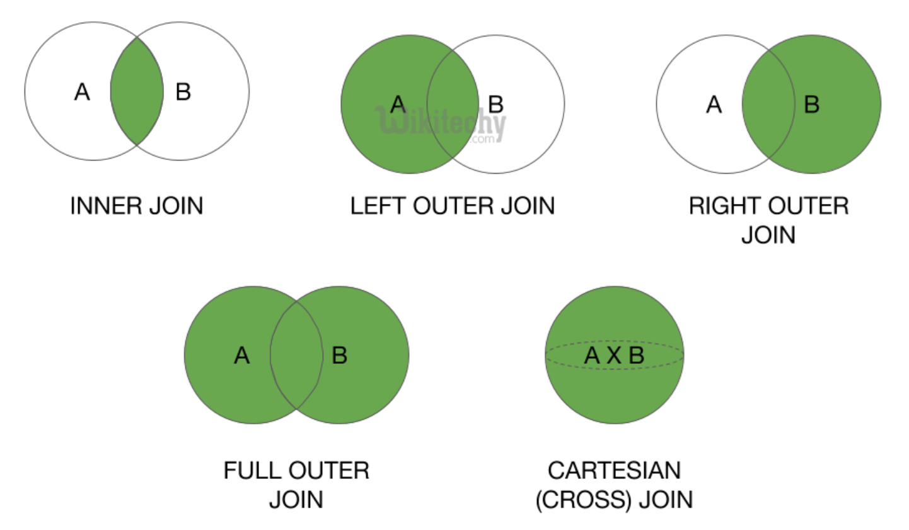

# Relational Databases & Datawarehousing

| Inhoud                                                                   |
| :----------------------------------------------------------------------- |
| [0. praktische info](#praktische-info)                                   |
| [1. SQL review](#SQL-review)                                             |
| [2. SQL Advanced](#SQL-advanced)                                         |
| [3. Window functions](#window-functions)                                 |
| [4. DB Programming](#DB-programming)                                     |
| [5. Indexen](#indexen)                                                   |
| [6. Basics of Transaction Management](#basics-of-transaction-management) |
| [7a. DWH + BI](#DWH-BI)                                                  |
| [7b. AdventureWorks Intro - Starschema - Filling](#AdventureWorks)       |

# praktische info

# SQL review

## Data Definition Language | DDL

- CREATE
- ALTER
- DROP

## Data Manipulation Language | DML

- SELECT
- INSERT
- UPDATE
- DELETE

## Data Control Language | DCL

- GRANT
- REVOKE
- DENY

<br>

| Wildcard | Description                           |
| -------- | ------------------------------------- |
| %        | 1 or more characters                  |
| \_       | 1 character                           |
| []       | 1 char in a specified range           |
| [^]      | every char not in the specified range |

<br>

| Clause   | Description                                        |
| -------- | -------------------------------------------------- |
| SELECT   | Specifies the colums to show up in the output      |
| DISTINCT | filters out the duplicates                         |
| FROM     | Table names                                        |
| WHERE    | Filter condition on individual lines in the output |
| GROUP BY | Grouping of data                                   |
| HAVING   | Filter conditions on groups                        |
| ORDER BY | Sorting                                            |

<br>

## WHERE

> =, >, >=, <, <=, <>  
> OR, AND, NOT  
> IN, NOT IN  
> IS NULL, IS NOT NULL  
> wildcards

<br>

## ORDER BY

> DESC

<br>

## Aliases

> AS 'insert name here'

<br>

## Calculated results

> +, -, /, \*

<br>

## Diverse functions

| type   | function                                                       |
| ------ | -------------------------------------------------------------- |
| format | LTRIM, RTRIM, LEN, LEFT, RIGHT, SUBSTRING, REPLACE, CONCAT ... |
| date   | DATEADD, DATEDIFF, DAY, MONTH, YEAR, GETDATE()                 |
| math   | ABS, ROUND, FLOOR, CEILING, COS, SIN, AVG, SUM                 |
| null   | ISNULL                                                         |
| other  | TOP, STR                                                       |

<br>

## CASE

```SQL
CASE
    WHEN condition1 THEN result1
    WHEN condition2 THEN result2
    WHEN conditionN THEN resultN
    ELSE result
END;
```

<br>

| having vs where |                                                      |
| --------------- | ---------------------------------------------------- |
| having          | works on groups, conditions on aggregation functions |
| where           | only works on indivdual rows                         |

<br>

## Consulting more then 1 table

> JOIN
>
> - inner join
> - outer join
> - cross join
>
> UNIONS <br>
> Subquery's
>
> - simple nested query's
> - correlated query's
> - operator EXISTS <br>
>
> SET operators <br>
> Common table expressions

<br>

## JOIN



### INNER JOIN

```SQL
SELECT column_name(s)
FROM table1
INNER JOIN table2
ON table1.column_name = table2.column_name;
```

### OUTER JOIN

```SQL
-- left outer join
SELECT column_name(s)
FROM table1 x
LEFT JOIN table2 y
ON x.column_name = y.column_name;

-- right outer join
SELECT column_name(s)
FROM table1 x
RIGHT JOIN table2 y
ON x.column_name = y.column_name;

--- Full outer join
SELECT column_name(s)
FROM table1 x
FULL OUTER JOIN table2 y
ON x.column_name = y.column_name
WHERE condition;
```

### CROSS JOIN

```SQL
SELECT column_name(s)
FROM table1 x
CROSS JOIN table2 y;
```

<br>

# SQL advanced

## Subqueries

- outer level query -> the first SELECT. This is the main question.
- inner level query -> the SELECT in the WHERE or HAVING clause. subquery.

The subquery is:

- always executed first
- always between ()
- Subqueries can be nested at > 1 level

a subquery can return **one value** or **a list of values**

<br>

### Subquery returns a single value

```SQL
--- products that cost more then the average

SELECT ProductID, ProductName, UnitPrice As MaxPrice
FROM Products
WHERE UnitPrice > (SELECT AVG (UnitPrice) FROM Products)


--- Who is the youngest employee from the USA

SELECT LastName, FirstName
FROM Employees
WHERE Country = 'USA'
AND BirthDate = (SELECT MAX(Birthdate) FROM Employees WHERE Country = 'USA')
```

<br>

### Subquery returns a single column

```SQL
--- Give all customers that have not placed an order yet

SELECT *
FROM customers
WHERE CustormerID NOT IN (SELECT DISTINCT CustomerID FROM Orders)

--- method via JOIN

SELECT *
FROM Customers c LEFT JOIN Orders o ON c.CustomerID = o.CustomerID
WHERE o.CustomerID IS NULL

```

<br>

### ANY and ALL keywords

|     |                                                                           |
| --- | ------------------------------------------------------------------------- |
| ANY | greater than every value                                                  |
| ALL | returns true if all values returned in the subquery satisfy the condition |

<br>

### Correlated subqueries

- inner query depends on the information of the outer query.
- subquery is executed for each row in the main query.
- the order is from top to bottom, not from bottom to top as in a simple subquery.

```SQL
SELECT ...
FROM table a
WHERE expression operator (
    SELECT ...
    From table
    WHERE expression operator a.columnname
)
```

Example: Give employees with a salary larger than the avarage salary.
```SQL
SELECT FirstName + ' ' + LastName As FullName, Salary, ReportsTo
FROM Employees AS e
WHERE Salary > (SELECT AVG(Salary) FROM Employees WHERE ReportsTo = e.ReportsTo)
```
### Subqueries and the EXISTS operator

- The operator exists test existence of a result set (Also a NOT EXISTS operator)

Example:
```SQL
SELECT * 
FROM Customers As c
WHERE EXISTS (SELECT * FROM Orders WHERE CustomerID = c.CustomerID)
```

### 3 ways to accomplish the same result

Example:
- OUTER JOIN
```SQL
SELECT *
FROM Customers c LEFT JOIN Orders o ON c.CustomerID = o.CustomerID
WHERE o.CustomerID IS NULL
```
- Simple Subquery
```SQL
SELECT *
FROM Customers
WHERE CustomerID NOT IN (SELECT DISTINCT CustomerID FROM Orders)
```
- Correlated subquery
```SQL
SELECT *
FROM Customers As c
WHERE NOT EXISTS
(SELECT * FROM Orders WHERE CustomerID = c.CustomerID)
```
### Subqueries in the FORM-clause

- Since the result of a query is a table it can be used in the FROM-clause.
- In MS-SQL Server the table in the subquery must have a name. You can optionally also rename the columns.
- A subquery in the FROM clause is called a derived table.
- Example: Give per region the total sales (region USA+Canada = North America, rest = Rest of World).
```SQL
SELECT Regionclass, COUNT(OrderID)
FROM(SELECT CASE c.Country 
WHEN 'USA' THEN 'Northern America' 
WHEN 'Canada' THEN 'Northern America' 
ELSE 'Rest of world' 
END AS Regionclass, o.OrderID 
FROM Customers c JOIN Orders o ON c.CustomerID = o.CustomerID)
AS Totals(Regionclass, OrderID)
GROUP BY Regionclass
```
## Subqueries in the SELECT-clause
- In a SELECT clause scalar (simple or correlated) subqueries can be used
    - Example: Give for each employee how much they earn more (or less) than the average salary of all employees with the same supervisor.
    ```SQL
    SELECT LastName, FirstName, Salary, Salary - (
        SELECT AVG(Salary)
        FROM Employees
        WHERE RepourtsTo = e.ReportsTo
    )
    FROM Employees e
    ```

### Subqueries in the SELECT- and FROM-clause
- Example: Give per category the price of the cheapest product and a product that has that price.
```SQL 
SELECT category, MinUnitPrice,
(
    SELECT TOP 1 ProductID
    FROM Products
    WHERE CategoryID = Category AND UnitPrice = MinUnitPrice
) AS ProductID
FROM
(
    SELECT CategoryID, MIN(UnitPrice)
    FROM Products p
    GROUP BY CategoryID
) AS CategoryMinPrice(Category, MinUnitPrice)
```
## DML

### SQL - DML basic tasks
- SELECT -> consulting data
- INSERT -> adding data
- UPDATE -> changing data
- DELETE -> removing data
- MERGE -> combine INSERT, UPDATE and DELETE

### Tip for not destorying your database
- The statements in this chapter are destructive.
- SQL has no UNDO by default!
- BUT you can 'simulate' UNDO if you take precautions.
```SQL 
/* Tip for not destroying ur database */
BEGIN TRANSACTION -- starts a new "transaction" -> Saves previous state of DB in buffer

--Several "destructive" commands can go here:
INSERT INTO Products(ProductName)
VALUES ('TestProduct')

-- Only you (in your session) can see changes
SELECT * FROM Products WHERE ProuctID = (SELECT MAX(ProductID) FROM Products)

ROLLBACK; --> ENDS transaction and restores database in previous state
-- COMMIT; --> ENDS transaction and makes changes permanent!!
```

## DML: INSERT: add new records

### Addint data - INSERT
- The INSERT statement adds data in a table
    - add one row through via specification
    - add selected row(s) from other tables

### INSERT of 1 row
- Method 1: specify only the (not NULL) values for specific columns.
- Method 2: specify all column values
- If the indentity is generated automatically, this column can't be mentioned.
```SQL
--1.
INSERT INTO Products(ProductName, CategoryID, Discontinued)
VALUES ('Toblerone', 3, 0)

--2.
INSERT INTO Products
Values ('Sultana', null,3,null,null, null, null, null,1z)
```

### INSERT of rows selected from other tables
- Mandatory fields have to be specified, unless they have a DEFAULT value.
- Contraints (see further) are validated.
- Unmentioned colums get the value NULL or the DEFAULT value in any.
Example:
```SQL
INSERT INTO Customers(CustomerID, ContactName, ContactTitle, CompanyName)
SELECT substring(FirstName,1,2)+ substring(LastName,1,3), FirstName + ' ' + LastName, Title, 'EmployeeCompany'
FROM Employees
```

## DML: UPDATE: modify values

### Changing data - UPDATE
- Changing all rows in a table
    - Example
    ```SQL
    UPDATE Products
    SET UnitPrice = UnitPrice *1.1
    ```
- Changing 1 row or a group of rows
    - Example
    ```SQL
    UPDATE Products
    Set UnitPrice = UnitPrice *1.1, UnitStock = 0
    WHERE ProductName Like '%Brod%'
    ```
- Change rows based on data in another table
    - Standard SQL does not offer JOINs in an update statement -> You can only use subqueries to refer to another table
    - Example: Due to change in the euro - dollar exchange rate, we have to increase the unit price of products delivered by suppliers from the USA by 10%
    ```SQL
    UPDATE Products
    SET UnitPrice = (UnitPrice * 1.1)
    WHERE SuppliersID in 
    (SELECT SupplierID FROM SUppliers WHERE Country = 'USA')
    ```
## DML: DELETE: Remove records

### Removing data - DELETE

- Delete some rows
    - Example
    ```sql
    DELETE FROM Products
    WHERE ProductName LIKE '%Brod%'
    ```
- Delete all rows in a table
    - via DELETE the identity values continues
    ```sql
    -- the identity value continues
    DELETE FROM Products
    ```
    - via TRUNCATE the identity value restarts from 1
    Truncate is also more performant, but does not offer WHERE clause: it's all or nothing
    ```sql
    -- The identity value restarts fromm 1
    TRUNCATE TABLE Products
    ```

### DELETE - Based on data in another table
- Change rows based on data in antoher table
    - Again no JOIN, only subquery
    - Exaple: Delete the orderdetails for all orders form the most recent orderdate
    ```SQL
    DELETE FROM OrderDetails
    WHERE OrderID IN
    (SELECT OrderID FROM Orders WHERE OrderDate = (SELECT MAX(OrderDate) FROM Orders))
    ```
### DML: MERGE: combine INSERT, UPDATE, DELETE

### Merge
- With MERGE you can combine INSERT, UPDATE and DELETE.
- Very common use case: users work on a Excel sheet to update a relatively large amount of records because Excel offers a better overview than their ERP tool.

- Script to create temporary table
```SQL
/* First execute following script to simulate the Excel file that has been imported to a temporary table ShippersUpdate */
DROP TABLE IF EXISTS ShippersUpdate;
-- Add everything from shippers to shippersUpdate
SELECT * INTO ShippersUpdate FROM Shippers

--Add an extra record to shippersUpdate
INSERT INTTO ShippersUpdate Values('Pickup', '(503) 555-9647')

-- Update a record of shippersUpdate
UPDATE ShippersUpdate SET Phone = ' (503) 555-4512' WHERE ShipperID = 1

-- REMOVE a record fromm ShippersUpdate
DELETE FROM ShippersUpdate WHERE ShipperID = 4
```

Merge result:


## Views

### Views - Introduction
- Definition
    - A view is a saved SELECT statement
    - A view can be seen as a virtual table composed of other tables & views
    - No data is stored in the view itself, at each referral the underlying SELECT is re-executed.
- Advantages
    - Hide complexity of the database
    - Used for securing data acces
    - Organise data for export to other applications
```SQL
CREATE VIEW view_name [(Column_List)] AS Select_Stement
[With check option]
```
- Number of columns in (Column_List) = # Columns in select
- The select statement may not contain an order by
- With check option: in case of mutation through the view (Insert, update, delete) it is chekced if the new data also conforms to the view conditions

### Views - CRUD operations

- Creating a view
```SQL
CREATE VIEW V_ProductsCustomer(Productcode, company, quantity)
AS SELECT od.ProductID, c.CompanyName, SUM(od.Quantity)
FROM Customers c
JOIN Orders o ON o.CustomerID - c.CustomerID
JOIN OrderDetails od ON o.OrderID = od.OrderID
GROUP BY od.ProductID, c.CompanyName
```
- Using a view 
```SQL
SELECT * FROM V_ProductsCustomer
```
- Changing a view
```SQL
ALTER VIEW V_ProductsCustomer(productcode, company)
AS SELECT od.ProductID, c.CompanyName
FROM Customers c
JOIN Orders o ON o.CustomerID = c.CustomerID
JOIN OrderDetails od on o.OrderID = od.OrderID
GROUP BY od.ProductID, c.CompanyName
```
- Deleting a view
```SQL
DROP VIEW V_ProductsCustomer
```

### Update of views
- An updateable view
    - Has no distinct or top clause in the select statement
    - Has no statistical functions in the select statement
    - Has no calculted value in the select
    - Has no Group by in the select
    - Does not use a union
- All other views are read-only views
- In general view are updatable if the system is able to translate the updates to individual records and fields in the underlying tables. So use you common sense.

### Working with updatable views
- UPDATE
    - You can update only once
    - Withouth check option
        - After the update a row can disappear from the view
    - With check option
        - An error is generated if after the update the row would no longer be part of view
- INSERT 
    - You can only insert in one table
    - All mandatory colums have to appear in the view and the insert
- DELETE
    - The delete can only be used with a VIEW based on exactly one table.

Examples: 


## COMMON TABLE EXPRESSIONS

### Common Table Expressions: The WITH component
- Example: Give the avarage number of orders for all customers
- Solution 1 -> Using subqueries
```sql
SELECT AVG(numberOfOrders *1.0) AS AverageNumberOfOrdersPerCustomer 
FROM
(
    SELECT customerID, COUNT(orderID)
    FROM orders
    GROUP BY customerID
) AS numberOfOrdersPerCustomer(customerID, numberOfOrders)
```
- Solution 2 -> USING CTE's
- Using the WITH-Componetn you can give the subquery its own name (with column names) and reuse it in the rest of the query.
```SQL
WITH numberofOrdersPerCUstomer(customerID, numberOfOrders) AS
(SELECT customerID, COUNT(orderID)
From orders
GROUP BY customerID
)
SELECT AVG(numberOfOrders *1.0) AS AvarageNumberOfOrdersPerCustomer
FROM numberOfOrdersPerCustomer
```
- The WITH-component has two application areas:
    - Simplify SQL-insturctions, e.g. simplified alternative for simple subqueries or avoid repetition of SQL constructs
    - Traverse recursivly hieracrchical and network structures

### CTE's versus Views
- Similarities
    - With ~ Create View
    - Both are virtual tables
- Differences
    - A CTE only exist during the SELECT-Statement
    - A CTE is not visible for ohter users and apps
### CTE's vers Subqueries
- Similarities
    - Both are virtual tables
- Differences
    - A CTE can be reused in the same qeury
    - A subquery is defined in the clause wher it is used
    - A simple subquery can always be replaced by a CTE

### CTE's to simplify queries
- Example: Give per category the minimum price and all products with that mninmum price
```sql
-- Solution 1 -> with subqueries
SELECT CategoryID, ProductID, UnitPrice
From Products p
WHERE UnitPrice = (SELECT MIN(UnitPrice) FROM Products WHERE CategoryID = p.CategoryID)
```
```SQL
-- Solution 2 -> with CTE's
WITH CategoryMinPrice(Category, MinPrice)
AS (SELECT CategoryID, MIN(UnitPrice)
    FROM Products AS p
    GROUP BY CategoryID)

SELECT Category, MinPrice, p.ProductID
FROM Products AS p
JOIN CategoryMinPrice AS c ON p.CategoryID - c.Category AND p.UnitPrice = c.MinPrice
```
### CTE's with more than 1 WITH - component

- Example: Give per year per customer the relative contribution of this customer to the total revenue
- Step 1: Calculate the total revenue per year
```SQL 
SELECT YEAR(OrderDate), SUM(od.UnitPrice*od.Quantity)
FROM Orders o INNER JOIN OrderDetails od
ON o.OrderID = od.OrderID
GROUP BY YEAR(OrderDate)
```
- Step 2: Calculate the total revenue per year per customer
```SQL
SELECT YEAR(OrderDate), o.CustomerID, SUM(od.UnitPrice * od.Quantity)
FROM Orders o INNER JOIN OrderDetails od
ON o.OrderID = od.OrderID
GROUP BY YEAR(OrderDate), o.CustomerID
```
- Step 3: Combine both


### Recursive SELECTS's
- Recursivity means: ...
- This allows you to solve problems live:
    - Who are the friends of my friends etc.()
    - What is the hierarchy of an organisation?
    - Find the parts and subparts of a product
- Example: Give the integers form 1 to 5
```SQL
WITH numbers(number) AS
(SELECT 1
    UNION all
    SELECT number +1
    FROM numbers
    WHERE number <5)

SELECT * FROM numbers
```
- Characteristics of recusive use of WITH
    - The with component consists of (at least) 2 expressions, combined with union all
    - A temp table is consulted in the second expression
    - At least one of the expressions may not refer to the temp table

### Recursive SELECT's: max number of recurisons = 100
- Example: Give the mubmers from 1 to 999
```SQL
WITH numbers(number) AS
(SELECT 1
    UNION all
    SELECT number +1
    FROM numbers
    WHERE number<999)
SELECT * FROM numbers
```
## Window Functions

### Window fucntions: business case

- Often business managers want to compare current sales to previous sales
- Window functions offer a solution to these kind of problems in a single, efficient SQL query

### OVER Clause
- Results of a SELECT are partitioned
- Numbering, ordering and aggregate functions per partition
- The `OVER` clauses creates partitions and ordering
- The partition behaves as a window that shifts over the data
- The OVER clause can be used with standard aggregate functions (sum, avg...) or specific window fucntions (rank, lag ...)

- Example: Make an overview of the UnitInStock per Category and per Product
```SQL
SELECT CategoryID, ProductID, UnitInStock
FROM Products
ORDER BY CategoryID, ProductID
```
- Add an extra column to calculate the running total of Units per Category
- Sol 1: Correlated subquery 8 (Inefficient as for each line the complete sum is recalculated)
```SQL
SELECT CategoryID, ProductID, UnitInStock,
(SELECT SUM(UnitInStock)
FROM Products
WHERE CategoryID = p.CategoryID
    AND ProductID <= p.ProductID) TotalUnitsInStockPerCategory
From Products p
ORDER BY CategoryID, ProductID
```
- Sol 2: `OVER` Clause (simpler + more efficient, The sum is calculated for each partition)
```SQL
SELECT CategoryID, ProductID, UnitsInStock,
SUM(UnitsInStock) OVER (PARTITION BY CategoryID ORDER BY CategoryID, ProductsID) TotalUnitsInStockPerCategory
FROM Products
ORDER BY CategoryID, ProductID
```

### Window functions - RANGE
- Real meaning of window functions: apply to a window that shifts over the result set
- The previous query works with the default window: start of result set to current row
```SQL
SELECT CategoryID, ProductID, UnitsInStock,
SUM(UnitsInStock) OVER (PARTITION BY CategoryID ORDER BY CategoryID, ProductsID
RANGE BETWEEN UNBOUNDED PRECEDING AND CURRENT ROW) TotalUnitsInStockPerCategory
FROM Products
ORDER BY CategoryID, ProductID
```
- With `Range` you have three valid options:
    - `RANGE BETWEEN UNBOUNDED PRECEDING AND CURRENT ROW`
    - `RANGE BETWEEN CURRENT ROW AND UNBOUNDED FOLLOWING`
    - `RANGE BETWEEN UNBOUNDED PRECEDING AND UNBOUNDED FOLLOWING`
- Partition is optional, ORDER BY is mandatory


 UNBOUNDED PRECEDING AND CURRENT ROW |  CURRENT ROW AND UNBOUNDED FOLLOWING |  UNBOUNDED PRECEDING AND UNBOUNDED FOLLOWING
:-----------------------------------:|:------------------------------------:|:--------------------------------------------:
||

### Window Functions - ROWS
- When you use RANGE, the current row is compared to other rows and grouped based on the ORDER BY predicate.
- This is not always disirable. You might actually want a physical offset.
- In this scenario, you would specify ROWS instead of RANGE. This gives you Three options in addition to the three options enumerated previously:
    - `ROWS BETWEEN N PRECEDING AND CURRENT ROW`
    - `ROWS BETWEEN CURRENT ROW AND N FOLLOWING`
    - `ROWS BETWEEN N PRECEDING AND N FOLLOWING`
- Examples: Make an overview of the salary per employee and the average salary of this employee and the 2 employees preceding him
```SQL
SELECT EmployeeID, FirstName + ' ' + LastName AS FullName, Salary, AVG(Salary) 
OVER (ORDER BY Salary DESC ROWS BETWEEN 2 PRECEDING AND CURRENT ROW) AS AvgSalary2Preceding
FROM Employees
```


- Example2: Make an overview of the salary per employee and the average salary of this employee and the 2 employees following him
```SQL
SELECT EmployeeID, FirstName + ' ' + LastName AS FullName, Salary, AVG(Salary)
OVER (ORDER BY Salary DESC ROWS BETWEEN CURRENT ROW AND 2 FOLLOWING) AS AvgSalary2Following
FROM Employees
```


- Example3: Make an overview of the salary per employee and the avarage salary of this employee and the employee preceding and following him.
```SQL
SELECT EmployeeID, FirstName + ' ' + LastName AS FullName, Salary, AVG(Salary)
OVER (ORDER BY Salary DESC ROWS BETWEEN 1 ROW AND 1 FOLLOWING) AS AvgSalary2Following
FROM Employees
```
